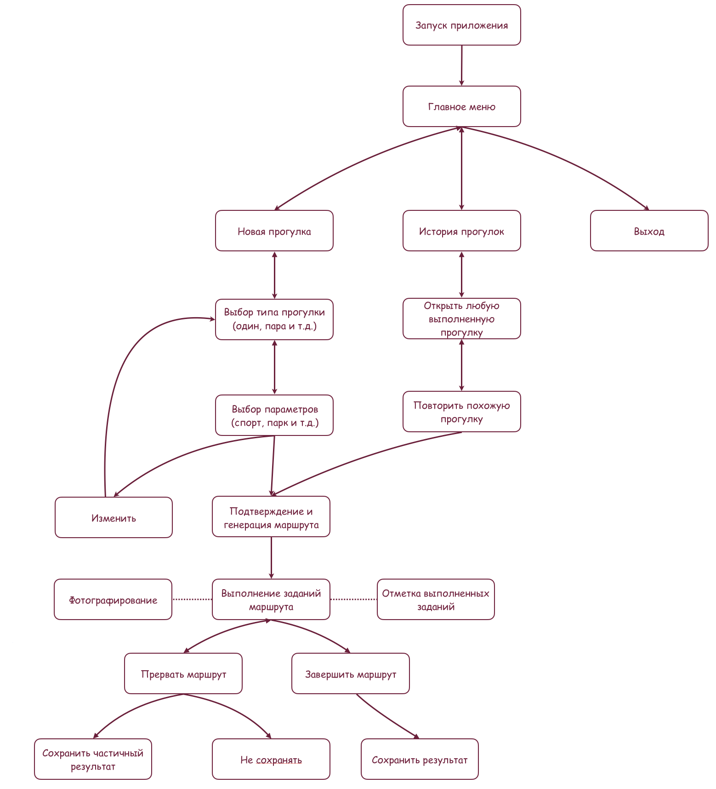
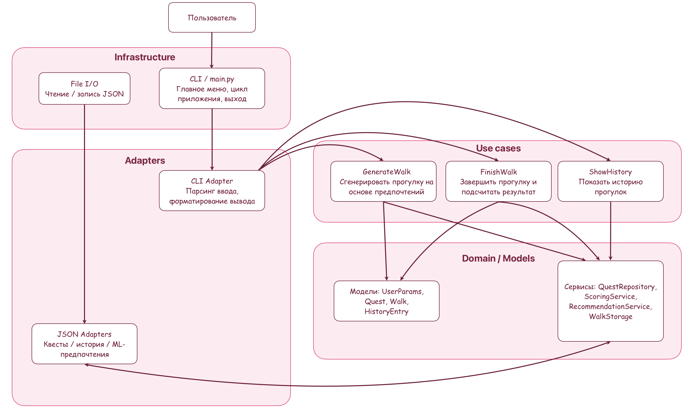

# Walkie — генератор прогулочных квестов

## 1. Введение, идея проекта и участники

**Walkie** — консольное игровое приложение на Python, которое превращает обычную прогулку в квест

Пользователь задаёт:

- тип активности: **один / пара / друзья / с собакой**
- доступное время
- текущее настроение
- конечную цель прогулки

Система подбирает подходящие задания из базы квестов, формирует маршрут и выдаёт список шагов с примерной длительностью. Каждое задание предполагает, что пользователь делает фотографию по мотивам выполненного шага, чтобы позже освежить воспоминания о прогулке

**Участники проекта**

[@banbutsuno_hoshi](https://t.me/banbutsuno_hoshi) — TeamLead\
[@Eva_monsher](https://t.me/Eva_monsher) — Dev2

## Docker

### Сборка образа

```bash
docker build -t walkie .
```

### Запуск контейнера

```bash
docker run --rm -e WALKIE_GREETING="Привет из Walkie!" -e WALKIE_DATA_DIR=/data walkie
```

### Переменные окружения

Конфигурация задаётся через переменные окружения, чтобы не хранить секреты в образе:

- `WALKIE_GREETING` — приветственное сообщение (по умолчанию: `Добро пожаловать в Walkie!`)
- `WALKIE_DATA_DIR` — путь к данным приложения (по умолчанию: `/data`)

## Тестирование

Установка зависимости для тестов:

```bash
pip install pytest pytest-cov
```

Запуск всех тестов:

```bash
pytest
```

Покрытие запускается автоматически через `pytest-cov` и выводится в консоль. При необходимости мы можем явно
указать параметры:

```bash
pytest --cov=cli --cov=domain --cov=use_cases --cov-report=term-missing
```

---


## 2. Схемы взаимодействия системы

### 2.1. Сценарий работы приложения глазами пользователя



### 2.2 Архитектурная схема слоев



## 3. Описание проекта

### 3.1. Что будет видеть пользователь

Пользователь работает с консольным приложением (CLI)

После запуска он видит:

- приветственное сообщение;
- главное меню с пунктами, например:
  - `1 — Новая прогулка`
  - `2 — История прогулок`
  - `3 — Выход`

При выборе **«Новая прогулка»** пользователь последовательно видит:

1. Экран выбора типа прогулки:  
   - `1 — Прогулка в одиночку`  
   - `2 — Прогулка для пары`  
   - `3 — Прогулка с друзьями`  
   - `4 — Прогулка с собакой`
2. Экран выбора параметров:
   - доступное время (в минутах)
   - текущее настроение (спокойное, активное, романтичное и т.д.)
   - цель прогулки (расслабиться, повеселиться, исследовать район и т.п.)
3. Экран подтверждения настроек:
   - краткое резюме выбранных параметров
   - варианты:
     - `1 — Подтвердить и сгенерировать прогулку`
     - `2 — Изменить настройки`
4. Экран со сгенерированным маршрутом:
   - список шагов (заданий) с кратким описанием и примерной длительностью
   - подсказка, что каждое задание сопровождается фотографией
5. Экран выполнения прогулки:
   - по мере прохождения пользователь отмечает выполнение заданий
   - после каждого задания предлагается сделать фото
6. Экран завершения/прерывания:
   - вариант «Завершить прогулку»
   - вариант «Прервать прогулку» с предложением сохранить частичный результат
7. Экран итогов:
   - количество выполненных заданий
   - краткий комментарий/оценка прогулки
   - сообщение о том, что прогулка сохранена в историю

При выборе **«История прогулок»** пользователь видит:

- список сохранённых прогулок (дата, тип, длительность, краткий итог)
- возможность открыть подробности выбранной прогулки:
  - список заданий
  - статус выполнения
  - комментарий/результат
  - фотографии
- возможность **повторить похожую прогулку**, используя параметры из истории

---

### 3.2. Задачи по разработке проекта и распределение ролей

Ниже перечислены основные задачи по реализации проекта, ориентировочное время на каждую и распределение обязанностей в команде.

#### 3.2.1. Список задач

| №  | Задача                                    | Краткое описание                                                                 | Оценка времени | Ответственный |
|----|-------------------------------------------|----------------------------------------------------------------------------------|----------------|---------------|
| 1  | Настройка репозитория на GitHub          | Создать репозиторий, настроить `.gitignore`, структуру папок, базовый README.   | 1 час          | Арсений       |
| 2  | Проработка сценариев и схем              | Описать пользовательские сценарии, нарисовать диаграммы (user flow, архитектура)| 2-3 часа       | Ева           |
| 3  | Описание проекта (документация)          | Подготовить `README.md` / отчёт с описанием идеи, назначения и сценариев        | 2-3 часа       | Арсений       |
| 4  | Проектирование моделей данных            | Определить структуры `UserParams`, `Quest`, `Walk`, формат JSON‑файлов          | 3–4 часа       | Арсений       |
| 5  | Реализация работы с JSON                 | Написать адаптеры для чтения/записи квестов и истории прогулок                  | 4–5 часов      | Ева           |
| 6  | Реализация генерации прогулки            | Use case `GenerateWalk`: фильтрация квестов по параметрам, формирование списка  | 5–6 часов      | Ева           |
| 7  | Реализация CLI‑интерфейса                | Главное меню, навигация, ввод/вывод, шаги диалога с пользователем               | 4–5 часов      | Ева           |
| 8  | Реализация истории прогулок              | Сохранение результатов, просмотр списка, детализация, повтор похожей прогулки   | 4–5 часов      | Оба           |
| 9  | Блок простых рекомендаций (ML/эвристика) | Учет настроения/истории для подбора заданий, даже в упрощённом виде             | 4–6 часов      | Арсений       |
| 10 | Тестирование и отладка                   | Проверка сценариев, корректности данных, устранение ошибок                      | 4–6 часов      | Оба           |
| 11 | Финальная полировка и подготовка к сдаче | Проверка документации, оформление, финальный прогон демонстрации                | 3–4 часа       | Оба           |

> NB: оценки времени ориентировочные и могут меняться в процессе работы

---

### 3.3. Временная оценка проекта в целом

Суммарно по задачам получается ориентировочно:

- **Минимальный объём (без сильного усложнения ML‑части):** ~35–40 часов общей работы команды
- **С учётом доработок, правок и подготовки к защите:** ~45–50 часов

Работа над проектом может быть распределена, например, так:

- 1 неделя — постановка задачи, схемы, черновая архитектура, базовый код
- 2 неделя — реализация основной логики и истории прогулок
- 3 неделя — доводка, тестирование, подготовка к сдаче, правки документации

---


## 4. Реализация проекта

Теперь опишем, **как именно реализован проект Walkie**: структура файлов, основные модули, формат данных и ход выполнения сценариев внутри программы

---

### 4.1. Структура проекта

Планируется организовать проект по папкам и модулям следующим образом:

- `main.py` — точка входа в приложение, консольный интерфейс и главный цикл
- `cli/`
  - `menu.py` — главное меню, выбор действий (новая прогулка, история, выход)
  - `prompts.py` — функции для опроса пользователя (тип прогулки, настроение, цель, время)
  - `views.py` — функции вывода: показ маршрута, заданий, итогов, истории
- `use_cases/`
  - `generate_walk.py` — логика создания новой прогулки
  - `finish_walk.py` — завершение прогулки и сохранение результата
  - `show_history.py` — работа с историей прогулок
- `domain/`
  - `models.py` — модели данных (`UserParams`, `Quest`, `WalkTask`, `Walk`, `HistoryEntry`)
  - `services.py` — доменные сервисы (`QuestRepository`, `RecommendationService`, `ScoringService`, `WalkStorage`)
  - `ports.py` — интерфейсы для будущих внешних зависимостей (`PhotoStorage`, `QuestRanker`)
- `infrastructure/`
  - `json_storage.py` — низкоуровневая работа с JSON‑файлами
  - `photo_storage.py` — заготовка для хранения фотографий в файловой системе
  - `database_storage.py` — заготовка для подключения БД
- `data/`
  - `quests.json` — база заданий и точек интереса
  - `history.json` — история прогулок (создаётся и пополняется при работе приложения)

Названия могут отличаться, но смысл такой: **отдельно интерфейс, отдельно логика, отдельно данные**.

---

### 4.2. Формат и хранение данных

#### 4.2.0. Локальная БД и каталоги данных

**Сейчас (реализовано):**

- Приложение хранит данные в локальных JSON-файлах.
- Каталог данных задаётся через `WALKIE_DATA_DIR` (по умолчанию: `/data`).
- В репозитории есть примерные файлы в `data/`, которые можно копировать или
  использовать как шаблон.
- Для фото в историю сохраняются **метаданные** (путь и подпись). Файл остаётся
  там, где его сохранил пользователь.

```
${WALKIE_DATA_DIR}/
  quests.json          # база заданий
  history.json         # история прогулок
```

**Планируется (уже есть интерфейсы и заглушки):**

- Локальное хранилище фотографий через `PhotoStorage` (`domain/ports.py`)
  и `FileSystemPhotoStorage` (`infrastructure/photo_storage.py`).
- Возможная миграция на полноценную БД через `DatabaseStorage`
  (`infrastructure/database_storage.py`).

Планируемая структура хранения фото (с копированием в каталог данных):

```
${WALKIE_DATA_DIR}/
  photos/
    <walk_id>/
      <task_id>/
        <timestamp>_<original_name>.jpg
```

При сохранении фотографий в `history.json` будут храниться **относительные пути**
от корня `WALKIE_DATA_DIR`, чтобы историю можно было переносить между машинами.


#### 4.2.1. Квесты (`quests.json`)

Каждый квест может описываться объектом следующим образом:

```json
{
  "id": 1,
  "title": "Сделать фото у памятника",
  "type": "friends",
  "mood": ["active", "fun"],
  "goals": ["have_fun", "explore_city"],
  "duration": 15,
  "location_type": "city_centre",
  ...
}
```

#### 4.2.2 История (`history.json`)

Каждая прогулка в истории может выглядеть так:

```json
{
  "id": 12,
  "date": "2025-11-25T18:30",
  "walk_type": "pair",
  "params": {
    "walk_type": "pair",
    "mood": "calm",
    "goal": "relax",
    "time_limit": 60
  },
  "tasks": [
    {
      "id": "task1",
      "title": "Прогуляться вдоль набережной",
      "completed": true,
      "photos": [
        {
          "file_path": "photos/12/task1/2025-11-25_1830_sunset.jpg",
          "file_path": "/home/user/photos/sunset.jpg",
          "caption": "Фото заката у воды"
        }
      ],
      "quest": {
        "id": 3,
        "title": "Прогуляться вдоль набережной",
        "type": "pair",
        "mood": ["calm"],
        "goals": ["relax"],
        "duration": 20,
        "location_type": "river"
      }
    }
  ],
  "score": 85,
  "status": "finished",
  "comment": "Очень спокойная прогулка"
}
```
Примечания:
- `tasks[].quest` хранит полные данные задания на момент прогулки.
- `tasks[].photos` хранит метаданные фото: путь и подпись.
## 4.3. Основные модули и их ответственность

---

### 4.3.1. `main.py`

- Инициализирует необходимые сервисы (репозиторий квестов, хранилище истории) 
- Запускает бесконечный цикл приложения:
  - показывает главное меню
  - считывает выбор пользователя
  - вызывает соответствующий use case

---

### 4.3.2. CLI‑слой (`cli/menu.py`, `cli/prompts.py`, `cli/views.py`)

Отвечает за всё, что видит и вводит пользователь:

- меню
- выбор типа прогулки
- ввод настроения, цели, доступного времени
- подтверждение параметров перед генерацией
- показ списка заданий
- отметка выполнения заданий
- выбор прогулки из истории

---

### 4.3.3. Use Cases (`use_cases/`)

#### `GenerateWalk` (`generate_walk.py`)
- получает параметры от CLI (`UserParams`)
- вызывает `QuestRepository` и `RecommendationService`
- подбирает задания по типу, настроению, цели и времени
- формирует объект `Walk` (маршрут + задания)
- возвращает его обратно в CLI для отображения

#### `FinishWalk` (`finish_walk.py`)
- получает от CLI, какие задания выполнены и какие фото сделаны
- вызывает `ScoringService` для расчёта результата
- передаёт данные в `WalkStorage` для сохранения в `history.json`
- сохраняет статус прогулки и комментарий пользователя

#### `ShowHistory` (`show_history.py`)
- через `WalkStorage` загружает историю
- отдаёт список прогулок в CLI
- по выбору пользователя загружает детали одной прогулки
- при желании пользователя запускает повтор похожей прогулки по параметрам истории

---

### 4.3.4. Доменный слой (`domain/models.py`, `domain/services.py`)

#### **Модели**
- `UserParams` — тип прогулки, настроение, цель, время 
- `Quest` — само задание
- `WalkTask` — задание в рамках прогулки (quest + completed + photos)
- `Walk` — конкретная прогулка (список `WalkTask`)
- `HistoryEntry` — запись в истории (параметры, задания, результат, комментарий)

#### **Сервисы**
- **`QuestRepository`**
  - загружает задачи из `quests.json`
  - фильтрует их по типу прогулки, настроению, цели и времени
  - возвращает подходящий набор заданий

- **`RecommendationService`**
  - использует историю (`history.json`)
  - например, снижает вес повторяющихся заданий и повышает вес того, что давно не предлагалось

- **`ScoringService`**
  - считает результат прогулки
  - учитывает количество выполненных заданий и наличие фото

- **`WalkStorage`**
  - через `json_storage.py` читает / пишет `history.json`
  - добавляет новые прогулки, возвращает список, ищет по `id`

---

### 4.3.5. Инфраструктура

- `infrastructure/json_storage.py` — базовая работа с JSON‑файлами
  - открывает файлы
  - читает их в Python‑структуры (`dict` / `list`)
  - записывает обновлённые данные обратно
- `infrastructure/photo_storage.py` — заглушка для будущего файлового хранилища фото
- `infrastructure/database_storage.py` — заглушка для будущего подключения БД

## 4.4. Ход выполнения основных сценариев

---

### 4.4.1. Новая прогулка

1. `main.py` → показать главное меню → пользователь выбирает «Новая прогулка»  
2. `cli.prompts` → спрашивает:  
   - тип прогулки
   - настроение 
   - цель
   - доступное время  
3. Собирается объект `UserParams`
4. Вызывается `GenerateWalk`:  
   - `QuestRepository` загружает все квесты из `quests.json` 
   - фильтрует их по параметрам
   - `RecommendationService` сортирует и дополняет список 
   - формируется объект `Walk` со списком заданий 
5. `cli.views` показывает пользователю маршрут и задания
6. Пользователь по ходу прогулки:  
   - отмечает выполнение заданий
   - после каждого задания при желании вводит путь к фото и подпись

7. При завершении или прерывании прогулки:
   - `FinishWalk` получает данные
   - `ScoringService` считает результат  
   - `WalkStorage` сохраняет прогулку в `history.json`
   - статус сохраняется как `finished` или `aborted`

---

### 4.4.2. Просмотр истории

1. В главном меню пользователь выбирает «История прогулок»
2. `ShowHistory` через `WalkStorage` читает `history.json`
3. `cli.views` показывает список прогулок
4. Пользователь выбирает одну прогулку:  
   - отображаются задания, статус, итоговый балл, комментарий и фотографии
5. Пользователь может повторить похожую прогулку:
   - на основе старых параметров создаётся `UserParams`
   - запускается `GenerateWalk` с этими параметрами
   - генерируется новый маршрут
